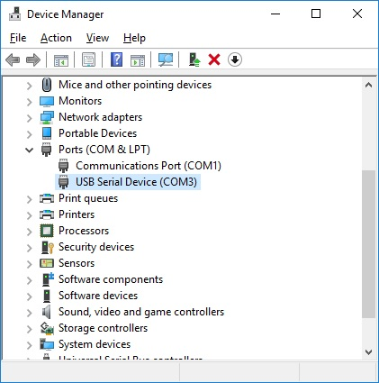

# HealthyPi Python Interface
A Python Interface for ProtoCentral HealthyPi v3

## Introduction
HealthyPi is a fully open-source vital signal monitoring system with Raspberry Pi. The HealthyPi add-on HAT would work independently to collect vital signals via package streaming.

This repository provides a Python interface for data collection and simple monitoring window that works on any platform that can run with Matplotlib. This repository also demonstrates the streaming package decoding method as an example for interface development in other languages.

## Usage

Use `python main.py -h` to print out the detail user manual.

Example usage: 
1. Connect the HealthyPi v3 HAT to your computer via USB interface
2. Check the communication port. In Windows you may check with device manager:

3. Run the Python interface with command:
	```bash
	python main.py -p COM3 -g -v
	```
	`-g` refers to the Matplotlib graphical interface for logging; and
	`-v` refers to verbose output from decoded data package
4. Press `CTRL` + `C` to quit (**This is a proper way to close communication, you may need to manually close thread if you don't use this way to close.**)
5. If you want to output collected data in CSV format, you can add the command option `-c`. The collected data will be stored in `./data/healthypiv3_yyyymmdd-HHMMSS_Numerics.csv` and `./data/healthypiv3_yyyymmdd-HHMMSS_Signals.csv`. The data formation in CSV file follows the pattern of BIDMC PPG and Respiration Dataset.

## Development Note
### Streaming Packet Format
The HealthyPi sends data out on the serial port in the following packet format.

|Offset|	Byte Value|	Description|
|---|---|---|
|0	|0x0A	|Start of frame|
|1	|0xFA	|Start of frame|
|2	|Payload Size LSB||	 
|3	|Payload Size MSB||	 
|4	|Protocol version	|(currently 0x02)|
|5-6	|ECG Value	|Signed int 16,LSB first|
|7-8	|Respiration Value	|Signed int 16,LSB first|
|9-12	|PPG IR Value	|Signed int 32, LSB first|
|13-16	|PPG Red Value	|Signed int 32, LSB first|
|17-18	|Temperature	|Signed int 16, LSB first|
|19	|Respiration Rate	|Unsigned int 8|
|20	|SpO2	|Unsigned int 8|
|21	|Heart Rate	|Unsigned int 8|
|21-23	|BP (not implemented)	|Not implemented yet|
|24	|SpO2 and ECG lead status	 ||
|25	|0x00	|Footer|
|26	|0x0B	|End of Frame|

### Precautions
- Matplotlib rendering is slow (~10FPS) when comparing with data collection speed (~120Hz). The synchronized data collection currently not able to provide smooth plotted curves.
- The PPG probe provides both infrared and visible light signals. By default the we display in Matploblib with IR signals but you may change the line
	```python
	y_ppg = np.append(y_ppg,collector.data[-1]["ppg_ir"])
	``` 
	into 
	```python
	y_ppg = np.append(y_ppg,collector.data[-1]["ppg_red"])
	```

## Reference
- [ProtoCentral HealthyPi v3 Official Site](http://healthypi.protocentral.com/)
- [ProtoCentral HealthyPi v3 Github Repository](https://github.com/Protocentral/protocentral-healthypi-v3/)
- [BIDMC PPG and Respiration Dataset](https://physionet.org/content/bidmc/1.0.0/)